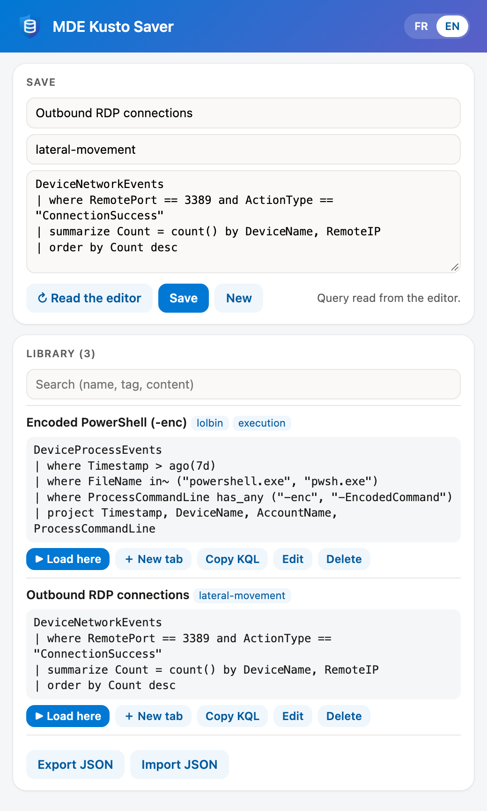
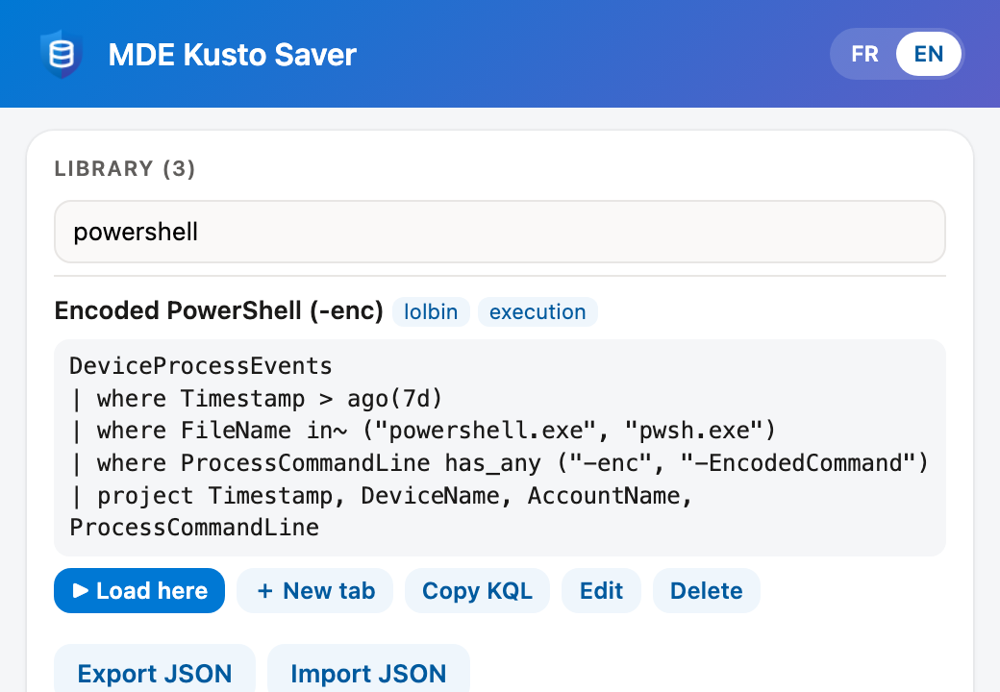
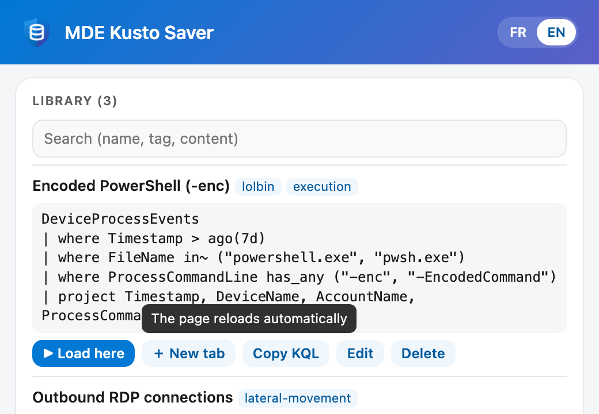

# MDE Kusto Saver

*A KQL query library for Microsoft Defender advanced hunting.* · [Version française](README.md)

Chrome / Edge extension (Manifest V3): a local library of KQL queries for Microsoft Defender advanced hunting (`security.microsoft.com`). Save a query from the editor, find it again, load it back in one click.⁣‌‌‌‌‌‌‌​​​‌​​​‌​​‍‌⁣



## Installation

1. Open `chrome://extensions` (or `edge://extensions`) and turn on **Developer mode**.
2. **Load unpacked** and select this folder.
3. Pin the icon (blue shield) to the toolbar.

After a code update: the extension's ↻ button in `chrome://extensions`.

## Language

The interface is available in French and English. The **FR | EN** buttons at the top right of the menu switch the language; the choice is remembered (`chrome.storage.sync`, so it follows browsers signed in to the same account). On first launch, the language follows the browser's (French if it starts with `fr`, otherwise English).

## Usage

### Save a query

1. Open advanced hunting (`security.microsoft.com/v2/advanced-hunting`).
2. Open the extension menu: the query of the active query tab is read automatically. « ↻ Read the editor » reads it again.
3. Enter a name and, if needed, comma-separated tags.
4. **Save**. The form is cleared: the next save creates a new entry.

The query can also be pasted into the field by hand.

### Find a query

Every word of the search must appear in the name, the tags or the query text (case-insensitive).



### Load a query

| Button | Effect |
|---|---|
| **▶ Load here** | Replaces the content of the active query tab, without reloading the page. Outside advanced hunting, behaves like « New tab ». |
| **＋ New tab** | Opens the query in a new query tab. Tabs already open keep their content. The page reloads automatically. |

Hovering a button immediately shows what it does:



Result in the advanced hunting editor:


### Other actions

- **Copy KQL**: copies the query text to the clipboard.
- **Edit** (or click the name): fills the form; « Save » updates the entry. « New » cancels.
- **Delete**: two clicks (« Confirm? »).
- **Export JSON**: downloads the whole library (`mde-kusto-queries-YYYY-MM-DD.json`).
- **Import JSON**: opens the menu in a tab (the file picker closes the menu), then pick the file. Invalid entries are skipped; an entry with the same `id` is replaced.

## Data

Stored locally in the browser profile: `chrome.storage.local`, key `queries`, newest entries first.

```json
[{ "id": "uuid", "name": "Exemple", "tags": ["mde"], "query": "DeviceEvents | take 10", "updated": "2026-10-04T12:00:00.000Z" }]
```

Nothing is sent anywhere. Export regularly to back up or share the library.

## Architecture

Same principles as Tenant Compass: no build step, vanilla JavaScript, pure functions in `lib.js` tested with Node.

| File | Role |
|---|---|
| `manifest.json` | Permissions `storage`, `unlimitedStorage`, `scripting`; host `security.microsoft.com` only |
| `popup.html` / `popup.js` | Menu (also the options page opened in a tab): form, list, import / export, language choice |
| `i18n.js` | FR / EN menu strings, `t()`, `applyI18n()`, `setLang()`; language in `chrome.storage.sync` (key `lang`) |
| `lib.js` | `huntingUrl`, `isHunting`, `parseTags`, `matches`, `upsert`, `mergeImport` |
| `test.js` | Tests: `node test.js` (Node 18+) |
| `icons/` | `icon.svg` (source: two-tone shield + database) and its PNG renders 16 / 32 / 48 / 128 |
| `docs/img/` | Screenshots of the READMEs (`fr/` and `en/` for the menu, per language) |
| `LICENSE` | Usage license |

- **No permanent content script.** The menu injects on demand (`chrome.scripting.executeScript`, `MAIN` world) a function that reads or writes the advanced hunting Monaco editor through `window.monaco`.
- **No network call, no token read.**
- **Deep link** (« New tab »): `https://security.microsoft.com/v2/advanced-hunting?query=…&timeRangeId=week`, where `query` is the KQL encoded as **UTF-16LE**, compressed with **gzip**, then **Base64** (a UTF-8 encoding shows up garbled in the editor).

## Limits

- Editor access relies on `window.monaco`, currently exposed by the Defender portal; if it goes away, « Load here » falls back to the deep link and reading is done by copy-paste.

## License

[PolyForm Noncommercial 1.0.0](LICENSE): free to copy, modify and share for any noncommercial use, provided the "Required Notice" line (author name and source) is kept. Any commercial use requires written agreement.
