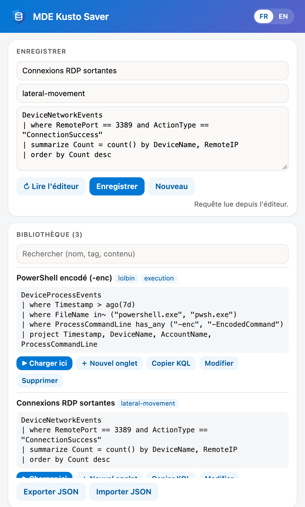
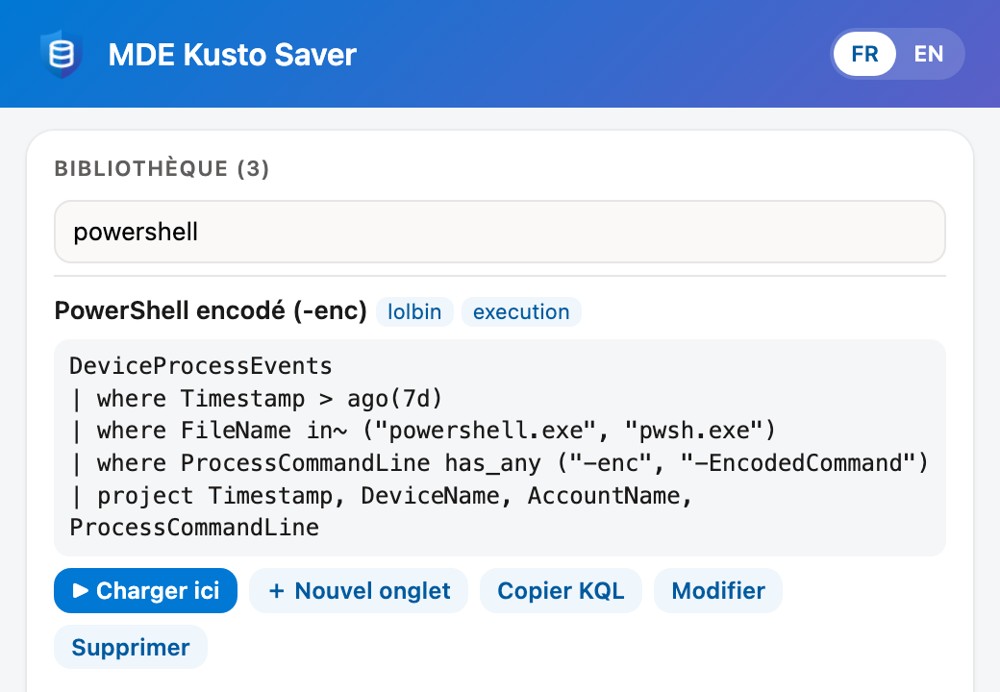
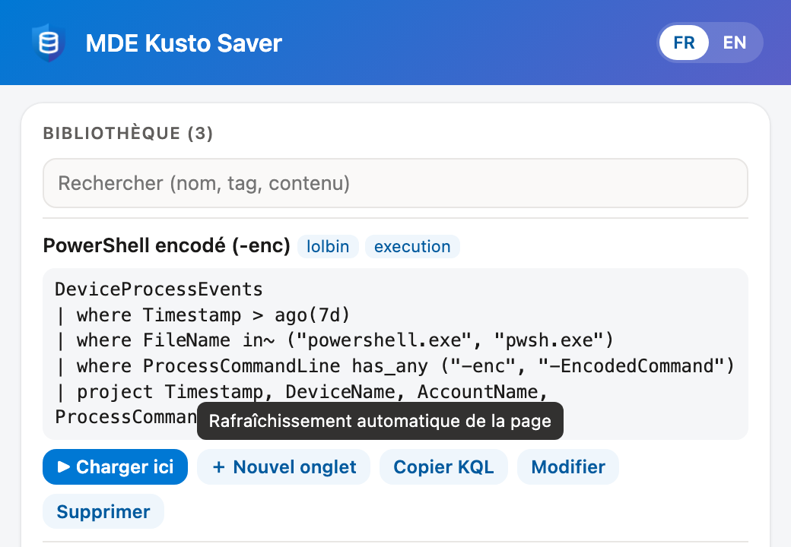

# MDE Kusto Saver

*Bibliothèque de requêtes KQL pour la chasse avancée Microsoft Defender.* · [English version](README.en.md)

Extension Chrome / Edge (Manifest V3) : bibliothèque locale de requêtes KQL pour la chasse avancée Microsoft Defender (`security.microsoft.com`). Enregistrer une requête depuis l'éditeur, la retrouver, la recharger en un clic.⁣‌‌‌‌‌‌‌​​​‌​​​‌​​‍‌⁣



## Installation

1. Ouvrir `chrome://extensions` (ou `edge://extensions`) et activer le **mode développeur**.
2. **Charger l'extension non empaquetée** et choisir ce dossier.
3. Épingler l'icône (bouclier bleu) dans la barre d'outils.

Après une mise à jour du code : bouton ↻ de l'extension dans `chrome://extensions`.

## Langue

L'interface existe en français et en anglais. Les boutons **FR | EN** en haut à droite du menu changent la langue ; le choix est mémorisé (`chrome.storage.sync`, donc suivi sur les navigateurs connectés au même compte). Au premier lancement, la langue suit celle du navigateur (français si elle commence par `fr`, sinon anglais).

## Utilisation

### Enregistrer une requête

1. Ouvrir la chasse avancée (`security.microsoft.com/v2/advanced-hunting`).
2. Ouvrir le menu de l'extension : la requête de l'onglet de requête actif est lue automatiquement. « ↻ Lire l'éditeur » la relit.
3. Saisir un nom et, si besoin, des tags séparés par des virgules.
4. **Enregistrer**. Le formulaire se vide : l'enregistrement suivant crée une nouvelle entrée.

La requête peut aussi être collée à la main dans le champ.

### Retrouver une requête

Tous les mots de la recherche doivent apparaître dans le nom, les tags ou le texte de la requête (casse ignorée).



### Charger une requête

| Bouton | Effet |
|---|---|
| **▶ Charger ici** | Remplace le contenu de l'onglet de requête actif, sans recharger la page. Hors de la chasse avancée, se comporte comme « Nouvel onglet ». |
| **＋ Nouvel onglet** | Ouvre la requête dans un nouvel onglet de requête. Les onglets déjà ouverts gardent leur contenu. La page se recharge automatiquement. |

Le survol d'un bouton affiche immédiatement ce qu'il fait :



Résultat dans l'éditeur de la chasse avancée :


### Autres actions

- **Copier KQL** : copie le texte de la requête dans le presse-papiers.
- **Modifier** (ou clic sur le nom) : remplit le formulaire ; « Enregistrer » met à jour l'entrée. « Nouveau » annule.
- **Supprimer** : deux clics (« Confirmer ? »).
- **Exporter JSON** : télécharge toute la bibliothèque (`mde-kusto-queries-AAAA-MM-JJ.json`).
- **Importer JSON** : ouvre le menu dans un onglet (le sélecteur de fichier ferme le menu), puis choisir le fichier. Les entrées invalides sont ignorées ; une entrée de même `id` est remplacée.

## Données

Stockage local au profil du navigateur : `chrome.storage.local`, clé `queries`, entrées les plus récentes en premier.

```json
[{ "id": "uuid", "name": "Exemple", "tags": ["mde"], "query": "DeviceEvents | take 10", "updated": "2026-10-04T12:00:00.000Z" }]
```

Rien n'est envoyé ailleurs. Exporter régulièrement pour sauvegarder ou partager la bibliothèque.

## Architecture

Même principes que Tenant Compass : pas d'étape de build, JavaScript vanilla, fonctions pures dans `lib.js` testées sous Node.

| Fichier | Rôle |
|---|---|
| `manifest.json` | Permissions `storage`, `unlimitedStorage`, `scripting` ; hôte `security.microsoft.com` uniquement |
| `popup.html` / `popup.js` | Menu (aussi page d'options ouverte en onglet) : formulaire, liste, import / export, choix de langue |
| `i18n.js` | Textes FR / EN du menu, `t()`, `applyI18n()`, `setLang()` ; langue dans `chrome.storage.sync` (clé `lang`) |
| `lib.js` | `huntingUrl`, `isHunting`, `parseTags`, `matches`, `upsert`, `mergeImport` |
| `test.js` | Tests : `node test.js` (Node 18+) |
| `icons/` | `icon.svg` (source : bouclier bicolore + base de données) et rendus PNG 16 / 32 / 48 / 128 |
| `docs/img/` | Captures des README (`fr/` et `en/` pour le menu, selon la langue) |
| `LICENSE` | Licence d'utilisation |

- **Aucun content script permanent.** Le menu injecte à la demande (`chrome.scripting.executeScript`, monde `MAIN`) une fonction qui lit ou écrit l'éditeur Monaco de la chasse avancée via `window.monaco`.
- **Aucun appel réseau, aucun jeton lu.**
- **Lien profond** (« Nouvel onglet ») : `https://security.microsoft.com/v2/advanced-hunting?query=…&timeRangeId=week`, où `query` est la KQL encodée en **UTF-16LE**, compressée en **gzip**, puis en **Base64** (un encodage UTF-8 s'affiche illisible dans l'éditeur).

## Limites

- L'accès à l'éditeur dépend de `window.monaco`, exposé aujourd'hui par le portail Defender ; s'il disparaît, « Charger ici » bascule sur le lien profond et la lecture se fait par copier-coller.

## Licence

[PolyForm Noncommercial 1.0.0](LICENSE) : copie, modification et partage gratuits autorisés pour tout usage non commercial, à condition de conserver la ligne « Required Notice » (nom de l'auteur et source). Tout usage commercial demande un accord écrit.
